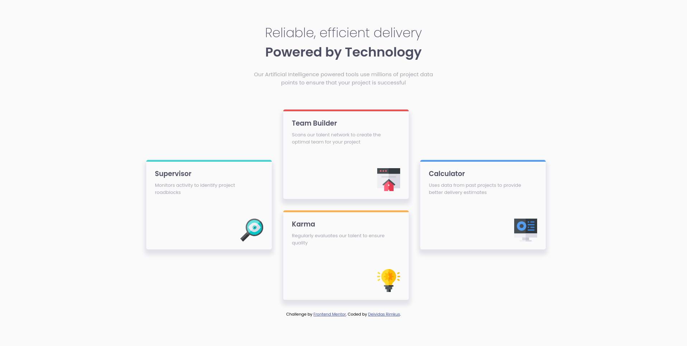

# Frontend Mentor - Four card feature section solution

This is a solution to the [Four card feature section challenge on Frontend Mentor](https://www.frontendmentor.io/challenges/four-card-feature-section-weK1eFYK). Frontend Mentor challenges help you improve your coding skills by building realistic projects.

## Table of contents

- [Overview](#overview)
  - [The challenge](#the-challenge)
  - [Screenshot](#screenshot)
  - [Links](#links)
- [My process](#my-process)
  - [Built with](#built-with)
  - [What I learned](#what-i-learned)
  - [Useful resources](#useful-resources)
- [Author](#author)

## Overview

### The challenge

Users should be able to:

- View the optimal layout for the site depending on their device's screen size

### Screenshot



### Links

- Solution URL: [URL](https://www.frontendmentor.io/solutions/four-card-feature-section-kGekXes_Xn)
- Live Site URL: [URL](https://lisviks.github.io/four-card-feature-section-frontendmentor/)

## My process

### Built with

- Semantic HTML5 markup
- Flexbox
- CSS Grid
- Mobile-first workflow

### What I learned

`box-shadow: h-offset v-offset blur spread color`, blur, spread and color are optional.

```html
<div class="card">
  <h1>Box Shadow</h1>
  <p>Box shadow example</p>
</div>
```

```css
.card {
  width: 200px;
  height: 200px;
  box-shadow: 0 10px 10px 10px grey;
}
```

### Useful resources

- [box-shadow](https://www.w3schools.com/cssref/css3_pr_box-shadow.asp)

## Author

- Website - [Deividas Rimkus](https://github.com/Lisviks)
- Frontend Mentor - [@Lisviks](https://www.frontendmentor.io/profile/Lisviks)
- Twitter - [@DRimkusDev](https://www.twitter.com/DRimkusDev)
